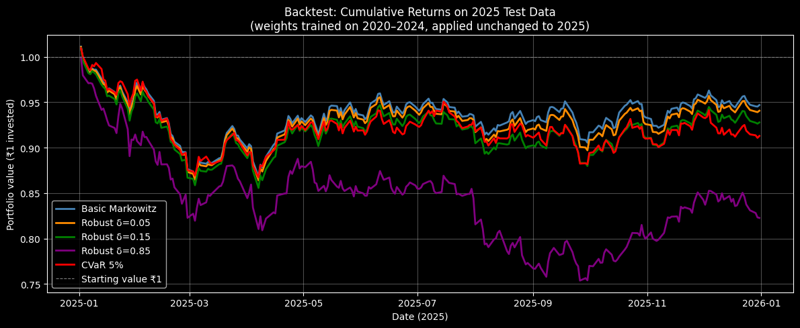
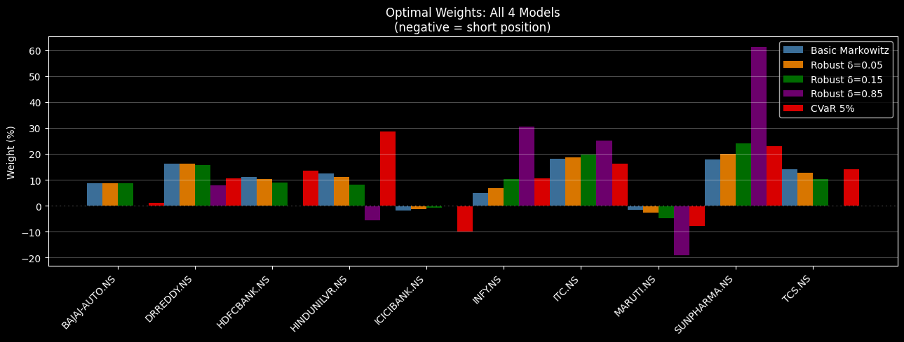

# Portfolio Optimization Using IBM DOcplex on NSE Equities

> Quadratic and Linear Programming applied to Indian equity portfolio construction,
> with out-of-sample backtesting on NSE large-cap stocks.

---

## Overview

This project implements three mathematically distinct portfolio optimization frameworks
using **IBM DOcplex (CPLEX Python API)** on 10 NSE large-cap stocks (2020–2025).
The goal is not just to optimize — but to compare how each model generalizes to
**unseen real market data** through rigorous backtesting.

---

## Models Implemented

### 1. Basic Markowitz (Quadratic Programming)
- Minimizes portfolio variance subject to a target return constraint
- Allows short selling with gross-exposure cap (leverage control)
- Includes optional transaction cost penalty and turnover constraint
- Solver: **DOcplex quadratic model (QP)**

### 2. Robust Optimization (Robust QP)
- Extends Markowitz by penalising uncertain return estimates
- Delta sweep from 0.05 → 1.10 to map the robustness-performance tradeoff
- Key finding: **higher delta → more overfitting, not more robustness**
- Solver: **DOcplex quadratic model (QP)**

### 3. CVaR — Conditional Value at Risk (Linear Programming)
- Minimizes expected loss in the worst α% of scenarios (tail risk)
- Reformulates the CVaR objective into a linear program using auxiliary variables
- One variable and one constraint per scenario day
- Key finding: **lowest max drawdown (−14.08%) in 2025 backtest**
- Solver: **DOcplex linear model (LP)**

---

## Dataset

| Property         | Value                                                                                    |
|------------------|------------------------------------------------------------------------------------------|
| Stocks           | HDFCBANK, ICICIBANK, TCS, INFY, HINDUNILVR, ITC, MARUTI, BAJAJ-AUTO, SUNPHARMA, DRREDDY |
| Exchange         | NSE (National Stock Exchange, India)                                                     |
| Source           | yfinance                                                                                 |
| Training period  | Jan 2020 – Dec 2024 (1238 trading days)                                                  |
| Test period      | Jan 2025 – Dec 2025 (249 trading days, never seen during training)                       |
| Risk-free rate   | 7% (Indian T-bill approximation)                                                         |

---

## Expected Return Estimation

Returns are not simple historical means. A **momentum-blended** estimate is used:
```
mu  =  0.6 × annualised_mean_return  +  0.4 × annualised_125d_momentum
```

This reflects the view that recent price trends carry signal about near-term performance,
while the long-run mean anchors the estimate against recency bias.

---

## Optimization Problem Formulations
```
════════════════════════════════════════════════════════════
  1. MARKOWITZ  —  Quadratic Program (QP)
════════════════════════════════════════════════════════════

  Minimize :   w^T · Σ · w

  Subject to:
    Σ  w_i            =  1          (fully invested)
    μ^T · w           ≥  r_target   (minimum return)
    -0.30  ≤  w_i    ≤  1.0        (weight bounds, short selling allowed)
    Σ  |w_i|          ≤  1.5        (gross exposure cap, limits leverage)


════════════════════════════════════════════════════════════
  2. ROBUST OPTIMIZATION  —  Penalised QP
════════════════════════════════════════════════════════════

  Pessimistic return per stock:
    effective_mu_i  =  mu_i  −  δ × σ_i

  Minimize :   w^T · Σ · w

  Subject to:
    Σ  w_i                       =  1
    Σ  effective_mu_i × w_i      ≥  r_target
    -0.30  ≤  w_i  ≤  1.0
    Σ  |w_i|  ≤  1.5

  where:
    σ_i  =  sqrt( Σ_ii )    per-stock annualised volatility
    δ    =  robustness level  (higher δ = more pessimistic)


════════════════════════════════════════════════════════════
  3. CVaR  —  Linear Program (LP)
════════════════════════════════════════════════════════════

  Minimize :   VaR  +  ( 1 / α·S ) · Σ_s  z_s

  Subject to:
    z_s   ≥  − R_s^T · w  −  VaR      for all scenarios s
    z_s   ≥  0                         for all scenarios s
    Σ  w_i   =  1
    μ^T · w  ≥  r_target

  where:
    S    =  number of scenarios (trading days)
    α    =  tail probability   (e.g. 0.05 = worst 5% of days)
    z_s  =  excess loss beyond VaR in scenario s
    VaR  =  Value-at-Risk threshold  (decision variable)
```

---

## Key Results

### Training Performance (in-sample, 2020–2024)

| Method           | Return  | Risk    | Sharpe |
|------------------|---------|---------|--------|
| Basic Markowitz  | 20.00%  | 15.96%  |  0.81  |
| Robust δ = 0.05  | 21.28%  | 16.09%  |  0.89  |
| Robust δ = 0.15  | 23.85%  | 16.44%  |  1.03  |
| Robust δ = 0.85  | 41.74%  | 21.89%  |  1.59  |
| CVaR 5%          | 20.00%  | 16.75%  |  0.78  |

### Backtest Performance (out-of-sample, 2025)

| Method           | Train Ret | Test Ret     | Test Risk | Sharpe | Max Drawdown   |
|------------------|-----------|--------------|-----------|--------|----------------|
| Basic Markowitz  |   20.00%  | **−4.95%**   |   10.90%  |  −1.10 |    −14.18%     |
| Robust δ = 0.05  |   21.28%  |   -5.60%     |   11.05%  |  -1.14 |    -14.51%     |
| Robust δ = 0.15  |   23.85%  |   −6.96%     |   11.44%  |  −1.22 |    −15.25%     |
| Robust δ = 0.85  |   41.74%  | **−18.48%**  |   16.32%  |  −1.56 |    −24.57%     |
| CVaR 5%          |   20.00%  |   −8.58%     |   11.61%  |  −1.34 | **−14.08% ✅** |

---






## Core Insights

**1. Training Sharpe is not a reliable signal.**
The model with the highest training Sharpe (Robust δ=0.85, Sharpe=1.59) delivered
the worst real-world return (−18.48%) and the worst drawdown (−24.57%).

**2. CVaR does what it promises.**
Despite the lowest training Sharpe, CVaR achieved the best max drawdown protection
in live 2025 data (−14.08%). It was built for crashes — and it survived one.

**3. Higher robustness delta = more overfitting.**
As delta increases, the optimizer must pick increasingly aggressive historical winners
to meet the target return after the pessimistic penalty. This concentrates the portfolio
in 2020–2024 outperformers (SUNPHARMA ~60%, INFY ~30% at δ=0.85) that reversed in 2025.

**4. Simple models generalise better.**
Basic Markowitz outperformed all more complex models on test return
(−4.95% vs −18.48% for the most complex model). Diversified weights beat concentrated bets.

**5. 2025 was a slow-grind bear market, not a crash.**
Test volatility (10–16%) was lower than training volatility (15–22%) for every model —
the market moved consistently downward with low daily swings. This is why CVaR's
tail-protection advantage was smaller than in a sharp crash scenario.

---

## Requirements
```
docplex
yfinance
pandas
numpy
matplotlib
```
```bash
pip install docplex yfinance pandas numpy matplotlib
# CPLEX community edition is bundled with docplex automatically
```

---

## References

- Markowitz, H. (1952). *Portfolio Selection.* Journal of Finance.
- Rockafellar, R.T. & Uryasev, S. (2000). *Optimization of Conditional Value-at-Risk.*
- Ben-Tal, A. & Nemirovski, A. (1999). *Robust solutions of uncertain linear programs.*
- IBM DOcplex Documentation: https://ibmdecisionoptimization.github.io/docplex-doc/

---

## Author

**Kumar Sanchaya**
BIT Mesra (2023–2027)
ksbhai01@gmail.com
https://www.linkedin.com/in/kumar-sanchaya-968091291/
